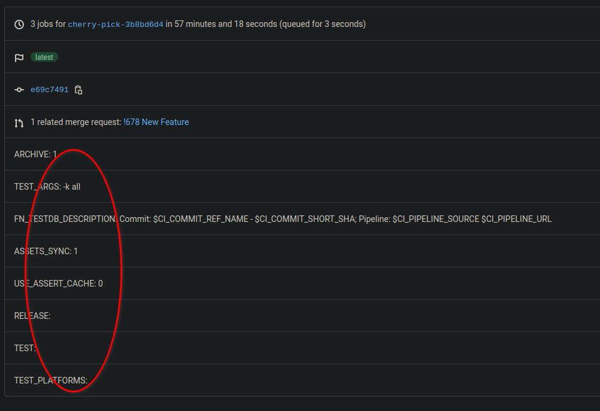

## Show Gitlab Pipeline Variables
This small script displays the pipeline variables alongside the web UI pipeline view (also shows in job view).



### Install
1. First update `gitlab_api_token` in [gitlab-pipeline-variable.js](./gitlab-pipeline-variables.js)
You can either create a new script in tampermonkey and paste the contents of `gitlab-pipeline-variables.js`.
Alternatively you can use the following stub, updating the path to the script.

```javascript
// ==UserScript==
// @name         Gitlab tools
// @namespace    http://tampermonkey.net/
// @version      0.1
// @description  Gitlab variables
// @author       Sergio Soldado
// @match        http://*gitlab*/*
// @require file://~/.config/tampermonkey/gitlab-pipeline-variables.js
// ==/UserScript==
```


[Go back](../README.md)